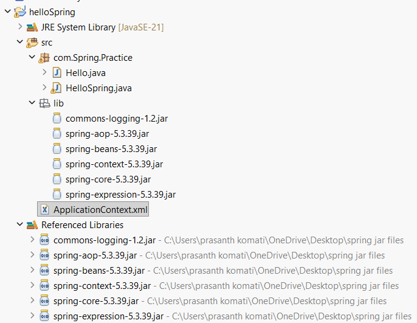

# Spring Framework - First Hello World Project



---

# Introduction

This is a simple **Spring Core Hello World Application**.

In this project:

- Spring IoC Container creates the object.
- The object is configured in `ApplicationContext.xml`.
- We retrieve the object using `getBean()`.
- Finally, we call the method and print **Hello World**.

---

# Project Structure

```text
helloSpring
│
├── src
│   └── com.Spring.Practice
│       ├── Hello.java
│       └── HelloSpring.java
│
├── ApplicationContext.xml
│
└── Spring JAR Files
```

---

# Step 1: Create POJO Class

## Hello.java

```java
package com.Spring.Practice;

public class Hello {

    public void display() {
        System.out.println("Hello World");
    }
}
```

### Explanation

- `Hello` is a simple Java class (POJO).
- It contains a method named `display()`.
- When the method is called, it prints:

```text
Hello World
```

---

# Step 2: Configure Bean in XML

## ApplicationContext.xml

```xml
<?xml version="1.0" encoding="UTF-8"?>

<beans xmlns="http://www.springframework.org/schema/beans"
       xmlns:xsi="http://www.w3.org/2001/XMLSchema-instance"
       xsi:schemaLocation="
       http://www.springframework.org/schema/beans
       https://www.springframework.org/schema/beans/spring-beans.xsd">

    <bean id="hello"
          class="com.Spring.Practice.Hello"/>

</beans>
```

### Explanation

This file is called the **Spring Configuration File**.

```xml
<bean id="hello"
      class="com.Spring.Practice.Hello"/>
```

- `id="hello"` → Bean name.
- `class="com.Spring.Practice.Hello"` → Class whose object Spring will create.

Equivalent Java code:

```java
Hello h = new Hello();
```

But in Spring, the container creates the object automatically.

---

# Step 3: Load Spring Container and Retrieve Bean

## HelloSpring.java

```java
package com.Spring.Practice;

import org.springframework.context.ApplicationContext;
import org.springframework.context.support.ClassPathXmlApplicationContext;

public class HelloSpring {

    public static void main(String[] args) {

        ApplicationContext context =
                new ClassPathXmlApplicationContext("ApplicationContext.xml");

        Hello h = (Hello) context.getBean("hello");

        h.display();
    }
}
```

---

# Detailed Explanation

## Create IoC Container

```java
ApplicationContext context =
        new ClassPathXmlApplicationContext("ApplicationContext.xml");
```

### What happens?

1. Spring reads `ApplicationContext.xml`.
2. Finds bean definitions.
3. Creates bean objects.
4. Stores them inside the IoC Container.

---

## Get Bean Object

```java
Hello h = (Hello) context.getBean("hello");
```

### What happens?

Spring searches for:

```xml
<bean id="hello"/>
```

and returns the corresponding object.

Equivalent normal Java code:

```java
Hello h = new Hello();
```

---

## Call Method

```java
h.display();
```

Output:

```text
Hello World
```

---

# Program Flow

```text
Start
  |
  v
Load ApplicationContext.xml
  |
  v
Create Hello Bean
  |
  v
Store Bean in IoC Container
  |
  v
getBean("hello")
  |
  v
Call display()
  |
  v
Print Hello World
  |
  v
End
```

---

# Output

```text
Hello World
```

---

# Key Concepts

## Bean

A Java object managed by Spring.

Example:

```xml
<bean id="hello"
      class="com.Spring.Practice.Hello"/>
```

---

## IoC (Inversion of Control)

Spring takes responsibility for object creation.

Without Spring:

```java
Hello h = new Hello();
```

With Spring:

```java
Hello h = (Hello) context.getBean("hello");
```

---

## ApplicationContext

`ApplicationContext` is a Spring IoC Container.

Responsibilities:

- Read configuration file.
- Create objects.
- Manage bean lifecycle.
- Provide beans when requested.

---

# Real-Life Analogy

Without Spring:

```text
You cook food yourself.
```

With Spring:

```text
You order food from a restaurant.
The restaurant prepares the food and serves it.
```

Similarly:

```text
Without Spring:
Programmer creates objects.

With Spring:
Spring creates and manages objects.
```

---

# Summary

1. Create a POJO class (`Hello.java`).
2. Configure it as a bean in `ApplicationContext.xml`.
3. Load Spring IoC Container.
4. Retrieve bean using `getBean()`.
5. Call the method.

### Final Output

```text
Hello World
```

This is the simplest Spring Core project and forms the foundation for learning:

- Spring Core
- IoC (Inversion of Control)
- Dependency Injection (DI)
- Bean Management
