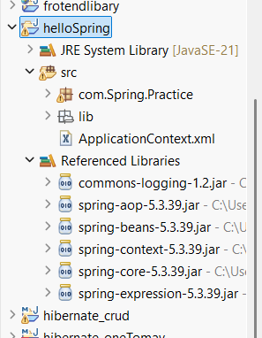

# Spring Hello World Project

<p align="center">
  
</p>

## Objective

Create a simple Spring application that prints:

```text
Hello Spring Framework
```

---

# Project Structure

```text
SpringHelloProject
│
├── src/main/java
│   └── com.spring.practice
│       ├── Hello.java
│       └── SpringMain.java
│
├── src/main/resources
│   └── applicationContext.xml
│
└── pom.xml
```

---

# Step 1: Create Maven Project

Create a Maven Project and add Spring dependency.

## pom.xml

```xml
<project xmlns="http://maven.apache.org/POM/4.0.0"
         xmlns:xsi="http://www.w3.org/2001/XMLSchema-instance"
         xsi:schemaLocation="http://maven.apache.org/POM/4.0.0
         http://maven.apache.org/xsd/maven-4.0.0.xsd">

    <modelVersion>4.0.0</modelVersion>

    <groupId>com.spring</groupId>
    <artifactId>SpringHelloProject</artifactId>
    <version>1.0</version>

    <dependencies>

        <dependency>
            <groupId>org.springframework</groupId>
            <artifactId>spring-context</artifactId>
            <version>6.2.0</version>
        </dependency>

    </dependencies>

</project>
```

---

# Step 2: Create Bean Class

## Hello.java

```java
package com.spring.practice;

public class Hello
{
    public void display()
    {
        System.out.println("Hello Spring Framework");
    }
}
```

---

# Step 3: Configure Bean

## applicationContext.xml

```xml
<?xml version="1.0" encoding="UTF-8"?>

<beans xmlns="https://www.springframework.org/schema/beans"
       xmlns:xsi="http://www.w3.org/2001/XMLSchema-instance"
       xsi:schemaLocation="
       https://www.springframework.org/schema/beans
       https://www.springframework.org/schema/beans/spring-beans.xsd">

    <bean id="hello"
          class="com.spring.practice.Hello"/>

</beans>
```

---

# Step 4: Load Spring Container

## SpringMain.java

```java
package com.spring.practice;

import org.springframework.context.ApplicationContext;
import org.springframework.context.support.ClassPathXmlApplicationContext;

public class SpringMain
{
    public static void main(String[] args)
    {
        ApplicationContext context =
                new ClassPathXmlApplicationContext("applicationContext.xml");

        Hello h = (Hello) context.getBean("hello");

        h.display();
    }
}
```

---

# Program Execution Flow

```text
applicationContext.xml
          │
          ▼
Spring Container
          │
          ▼
Creates Hello Bean
          │
          ▼
SpringMain
          │
          ▼
getBean("hello")
          │
          ▼
display()
          │
          ▼
Hello Spring Framework
```

---

# Output

```text
Hello Spring Framework
```

---

# Key Concepts

## What is Spring?

Spring is a lightweight Java framework used to build enterprise applications.

### Features

- Lightweight
- Open Source
- Dependency Injection
- Inversion of Control
- AOP Support
- Transaction Management

---

## What is a Bean?

A Bean is an object managed by the Spring Container.

Example:

```xml
<bean id="hello"
      class="com.spring.practice.Hello"/>
```

---

## What is Spring Container?

Spring Container is responsible for:

- Creating Objects
- Managing Objects
- Injecting Dependencies
- Managing Bean Lifecycle

---

## What is ApplicationContext?

ApplicationContext is an implementation of Spring Container.

Example:

```java
ApplicationContext context =
new ClassPathXmlApplicationContext("applicationContext.xml");
```

---

## What is IoC?

IoC (Inversion of Control) means Spring creates and manages objects instead of the programmer.

Without Spring:

```java
Hello h = new Hello();
```

With Spring:

```java
Hello h = context.getBean(Hello.class);
```

---

# Interview Questions

## What is Spring Framework?

Spring is a lightweight Java framework that simplifies enterprise application development.

---

## What is a Bean?

A Bean is an object created and managed by the Spring Container.

---

## What is ApplicationContext?

ApplicationContext is a Spring Container used to load configuration files and manage beans.

---

## What is IoC?

IoC means object creation and management are handled by the Spring Container.

---

## What is Dependency Injection?

Dependency Injection is the process of providing required objects to a class instead of creating them manually.

---

# Summary

✅ First Spring Project

✅ Maven Configuration

✅ Spring Dependency

✅ Bean Creation

✅ XML Configuration

✅ ApplicationContext

✅ Spring Container

✅ IoC Concept

✅ Hello World Program

---

# Next Topic

➡ Bean Creation and Bean Lifecycle

➡ Setter Injection

➡ Constructor Injection

➡ Autowiring

➡ Bean Scope

➡ Spring Annotations

➡ Spring Java Configuration

➡ Spring MVC

➡ Spring Boot
