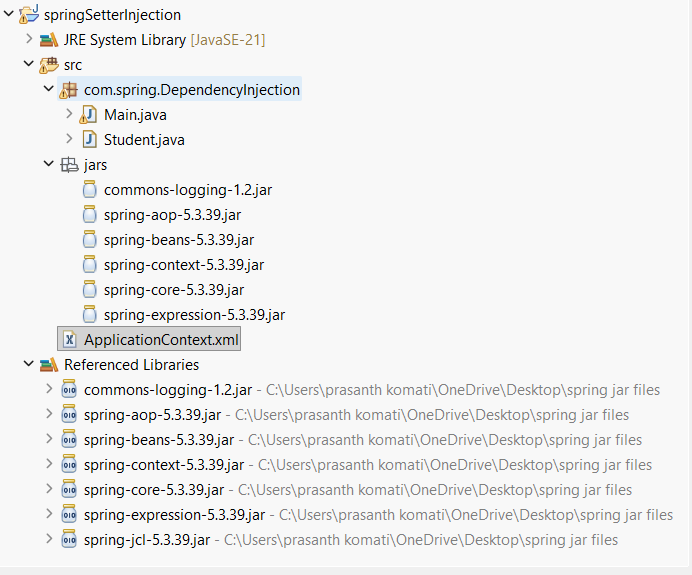

# Spring Framework - Setter Injection Example

<p align="center">
    
</p>

---

# 1. Introduction

This project demonstrates Dependency Injection (DI) using the Spring Framework.

In this example, Spring creates a Student object and injects values into its properties using Setter Injection.

Instead of creating and configuring the object manually, Spring manages the object life cycle through the IoC Container.

---

# 2. Project Structure

```text
springSetterInjection
│
├── src
│   └── com.spring.DependencyInjection
│       ├── Main.java
│       └── Student.java
│
├── jars
│   ├── commons-logging-1.2.jar
│   ├── spring-aop-5.3.39.jar
│   ├── spring-beans-5.3.39.jar
│   ├── spring-context-5.3.39.jar
│   ├── spring-core-5.3.39.jar
│   └── spring-expression-5.3.39.jar
│
└── ApplicationContext.xml
```

---

# 3. Aim

To understand Dependency Injection using Setter Injection in Spring Framework.

---

# 4. Software Requirements

- Java JDK 21
- Eclipse IDE
- Spring Framework 5.3.39
- Windows Operating System

---

# 5. Required JAR Files

```text
commons-logging-1.2.jar
spring-aop-5.3.39.jar
spring-beans-5.3.39.jar
spring-context-5.3.39.jar
spring-core-5.3.39.jar
spring-expression-5.3.39.jar
```

---

# 6. Procedure

## Step 1: Create Java Project

Open Eclipse

```text
File
 └── New
      └── Java Project
```

Project Name:

```text
springSetterInjection
```

Click Finish.

---

## Step 2: Add Spring JAR Files

Right Click Project

```text
Build Path
   └── Configure Build Path
```

Click

```text
Libraries
   └── Add External JARs
```

Select all Spring JAR files.

Click

```text
Apply and Close
```

---

## Step 3: Create Package

```text
com.spring.DependencyInjection
```

---

## Step 4: Create Student Class

### Student.java

```java
package com.spring.DependencyInjection;

public class Student {

    private String name;
    private int rollNo;

    public void setName(String name) {
        this.name = name;
    }

    public void setRollNo(int rollNo) {
        this.rollNo = rollNo;
    }

    public void showDetails() {
        System.out.println("Name : " + name);
        System.out.println("Roll No : " + rollNo);
    }
}
```

### Explanation

Variables:

```java
private String name;
private int rollNo;
```

Store student information.

Setter methods:

```java
setName()
setRollNo()
```

Used by Spring to inject values.

Method:

```java
showDetails()
```

Displays student information.

---

## Step 5: Create Main Class

### Main.java

```java
package com.spring.DependencyInjection;

import org.springframework.context.ApplicationContext;
import org.springframework.context.support.ClassPathXmlApplicationContext;

public class Main {

    public static void main(String[] args) {

        ApplicationContext context =
                new ClassPathXmlApplicationContext("ApplicationContext.xml");

        Student s = (Student) context.getBean("student");

        s.showDetails();
    }
}
```

### Explanation

Load Spring Container:

```java
ApplicationContext context =
new ClassPathXmlApplicationContext("ApplicationContext.xml");
```

Get Bean:

```java
Student s =
(Student) context.getBean("student");
```

Call Method:

```java
s.showDetails();
```

---

## Step 6: Create XML Configuration File

### ApplicationContext.xml

```xml
<?xml version="1.0" encoding="UTF-8"?>

<beans xmlns="http://www.springframework.org/schema/beans"
       xmlns:xsi="http://www.w3.org/2001/XMLSchema-instance"
       xsi:schemaLocation="
       http://www.springframework.org/schema/beans
       http://www.springframework.org/schema/beans/spring-beans.xsd">

    <bean id="student"
          class="com.spring.DependencyInjection.Student">

        <property name="name" value="Tharun"/>

        <property name="rollNo" value="101"/>

    </bean>

</beans>
```

---

# 7. How Setter Injection Works

Spring reads:

```xml
<property name="name" value="Tharun"/>
```

Internally Spring executes:

```java
student.setName("Tharun");
```

Spring reads:

```xml
<property name="rollNo" value="101"/>
```

Internally Spring executes:

```java
student.setRollNo(101);
```

---

# 8. Internal Flow

```text
ApplicationContext.xml
          │
          ▼
Spring Container Starts
          │
          ▼
Creates Student Object
          │
          ▼
setName("Tharun")
          │
          ▼
setRollNo(101)
          │
          ▼
Stores Bean
          │
          ▼
getBean("student")
          │
          ▼
showDetails()
          │
          ▼
Output
```

---

# 9. Output

```text
Name : Tharun
Roll No : 101
```

---

# 10. Advantages of Setter Injection

✔ Loose Coupling

✔ Easy Configuration

✔ Easy Maintenance

✔ Better Reusability

✔ Spring Manages Objects

✔ Easy Testing

✔ Flexible Object Creation

---

# 11. Key Concepts Learned

## Spring Framework

A framework used to develop Java Enterprise Applications.

## IoC (Inversion of Control)

Spring controls object creation instead of the programmer.

## Dependency Injection (DI)

Spring injects required values or objects into another object.

## Setter Injection

Dependencies are injected through setter methods.

## Bean

An object managed by the Spring Container.

## ApplicationContext

Spring Container responsible for creating and managing beans.

---

# 12. Conclusion

In this project, Spring Framework creates a Student object and injects values using Setter Injection through the ApplicationContext.xml file.

The IoC Container manages object creation, property injection, and bean life cycle. This reduces tight coupling and makes applications easier to maintain and extend.

Output:

```text
Name : Tharun
Roll No : 101
```
