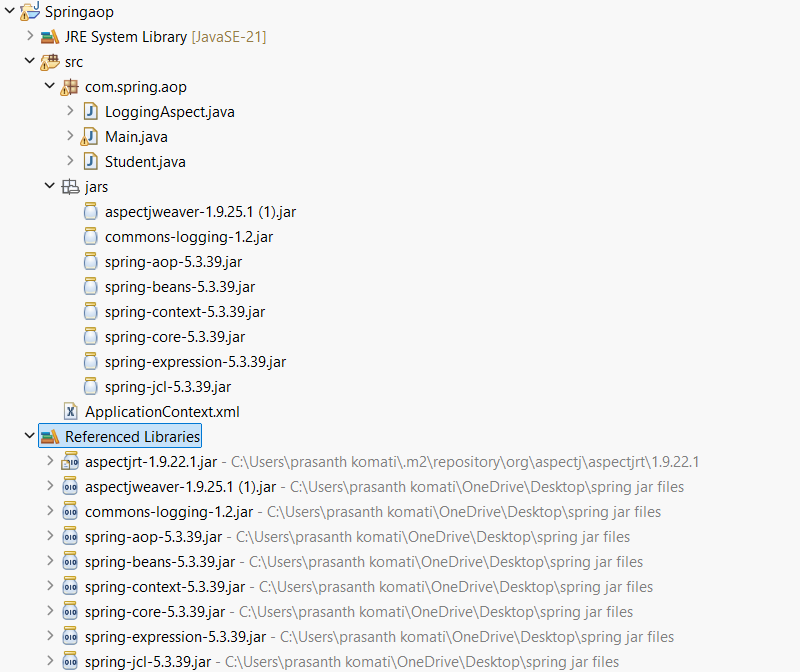

# Spring AOP (Aspect-Oriented Programming)

---

# 1. Introduction

In software development, some functionalities are required in many places throughout an application.

Examples:

- Logging
- Security
- Transaction Management
- Exception Handling
- Performance Monitoring

These functionalities are called **Cross-Cutting Concerns** because they affect multiple modules of an application.

Without AOP, developers write the same code repeatedly inside different methods.

Spring AOP solves this problem by separating cross-cutting concerns from business logic.

---

# Real-Time Example

Consider a College Management System.

Whenever a student performs an action:

```text
Login
   ↓
Perform Operation
   ↓
Logout
```

Examples:

- View Result
- View Attendance
- View Fee Details

The Login and Logout operations are common for every method.

Instead of writing them repeatedly, AOP allows us to write them once and apply them automatically.

---

# PART 1 : WITHOUT AOP

---

# Project Structure

```text
WithoutAOP
│
└── src
    └── com.spring.aop
        ├── Student.java
        └── Main.java
```

---

# Student.java

```java
package com.spring.aop;

public class Student {

    public void result() {

        // Logging Code
        System.out.println("Login Attempting");

        // Business Logic
        System.out.println("Viewing Result");

        // Logging Code
        System.out.println("Exit");
    }

    public void attendance() {

        // Logging Code
        System.out.println("Login Attempting");

        // Business Logic
        System.out.println("Viewing Attendance");

        // Logging Code
        System.out.println("Exit");
    }

    public void feeDetails() {

        // Logging Code
        System.out.println("Login Attempting");

        // Business Logic
        System.out.println("Viewing Fee Details");

        // Logging Code
        System.out.println("Exit");
    }
}
```

---

# Main.java

```java
package com.spring.aop;

public class Main {

    public static void main(String[] args) {

        Student s = new Student();

        s.result();

        System.out.println();

        s.attendance();

        System.out.println();

        s.feeDetails();
    }
}
```

---

# Output

```text
Login Attempting
Viewing Result
Exit

Login Attempting
Viewing Attendance
Exit

Login Attempting
Viewing Fee Details
Exit
```

---

# Problems Without AOP

## Code Duplication

The following code is repeated in every method:

```java
System.out.println("Login Attempting");
System.out.println("Exit");
```

---

## Difficult Maintenance

If logging changes:

```java
Login Attempting
```

to

```java
User Logged In Successfully
```

all methods must be modified.

---

## Poor Readability

Business logic and logging code are mixed together.

```java
public void result() {

    System.out.println("Login Attempting");

    System.out.println("Viewing Result");

    System.out.println("Exit");
}
```

---

# Visualization

```text
result()
 ├─ Login
 ├─ Business Logic
 └─ Exit

attendance()
 ├─ Login
 ├─ Business Logic
 └─ Exit

feeDetails()
 ├─ Login
 ├─ Business Logic
 └─ Exit
```

Logging code is repeated everywhere.

---

# PART 2 : WITH AOP

---

# Project Structure

```text

SpringAOP
│
├── src
│   └── com.spring.aop
│       ├── Student.java
│       ├── LoggingAspect.java
│       └── Main.java
│
├── ApplicationContext.xml
│
└── JAR Files
    ├── spring-aop-5.3.39.jar
    ├── spring-beans-5.3.39.jar
    ├── spring-context-5.3.39.jar
    ├── spring-core-5.3.39.jar
    ├── spring-expression-5.3.39.jar
    ├── spring-jcl-5.3.39.jar
    ├── commons-logging-1.2.jar
    ├── aspectjrt-1.9.25.jar
    └── aspectjweaver-1.9.25.1.jar
```

---

# Student.java

```java
package com.spring.aop;

public class Student {

    public void result() {

        System.out.println("Viewing Result");
    }

    public void attendance() {

        System.out.println("Viewing Attendance");
    }

    public void feeDetails() {

        System.out.println("Viewing Fee Details");
    }
}
```

---

# LoggingAspect.java

```java
package com.spring.aop;

import org.aspectj.lang.annotation.After;
import org.aspectj.lang.annotation.Aspect;
import org.aspectj.lang.annotation.Before;

@Aspect
public class LoggingAspect {

    @Before("execution(* com.spring.aop.Student.*(..))")
    public void beforeMethod() {

        System.out.println("Login Attempting");
    }

    @After("execution(* com.spring.aop.Student.*(..))")
    public void afterMethod() {

        System.out.println("Exit");
    }
}
```

---

# ApplicationContext.xml

```xml
<?xml version="1.0" encoding="UTF-8"?>

<beans xmlns="http://www.springframework.org/schema/beans"
       xmlns:xsi="http://www.w3.org/2001/XMLSchema-instance"
       xmlns:aop="http://www.springframework.org/schema/aop"
       xsi:schemaLocation="
       http://www.springframework.org/schema/beans
       https://www.springframework.org/schema/beans/spring-beans.xsd

       http://www.springframework.org/schema/aop
       https://www.springframework.org/schema/aop/spring-aop.xsd">

    <aop:aspectj-autoproxy/>

    <bean id="s"
          class="com.spring.aop.Student"/>

    <bean id="loggingAspect"
          class="com.spring.aop.LoggingAspect"/>

</beans>
```

---

# Main.java

```java
package com.spring.aop;

import org.springframework.context.ApplicationContext;
import org.springframework.context.support.ClassPathXmlApplicationContext;

public class Main {

    public static void main(String[] args) {

        ApplicationContext context =
                new ClassPathXmlApplicationContext("ApplicationContext.xml");

        Student s = (Student) context.getBean("s");

        s.result();

        System.out.println();

        s.attendance();

        System.out.println();

        s.feeDetails();
    }
}
```

---

# Output

```text
Login Attempting
Viewing Result
Exit

Login Attempting
Viewing Attendance
Exit

Login Attempting
Viewing Fee Details
Exit
```

---

# How AOP Works Internally

When:

```java
s.result();
```

is called,

Spring internally performs:

```text
Before Advice
      ↓
result()
      ↓
After Advice
```

Actual Flow:

```text
Login Attempting
      ↓
Viewing Result
      ↓
Exit
```

---

# AOP Terminology

## Aspect

```java
@Aspect
public class LoggingAspect
```

Contains common functionality.

---

## Advice

```java
@Before
@After
```

Action executed before or after a method.

---

## Join Point

```java
result()
attendance()
feeDetails()
```

Methods where advice can be applied.

---

## Pointcut

```java
execution(* com.spring.aop.Student.*(..))
```

Selects all methods of Student class.

---

## Target Object

```java
Student
```

Actual business object.

---

## Proxy Object

```text
Client
   ↓
Proxy
   ↓
Student
```

Spring creates the proxy automatically.

---

# Comparison

| Without AOP | With AOP |
|------------|----------|
| Logging code repeated in every method | Logging written once |
| High code duplication | No duplication |
| Difficult maintenance | Easy maintenance |
| Business logic mixed with logging | Clean separation |
| Less reusable | Highly reusable |
| More coding effort | Less coding effort |

---

# Advantages of AOP

### 1. Reduces Code Duplication

Logging code is written once.

---

### 2. Improves Readability

Business classes contain only business logic.

```java
public void result() {
    System.out.println("Viewing Result");
}
```

---

### 3. Easy Maintenance

Changes are made in one aspect class.

---

### 4. Better Reusability

One aspect can work with many classes.

---

### 5. Separation of Concerns

Business Logic:

```java
Student.java
```

Cross-Cutting Concern:

```java
LoggingAspect.java
```

---

### 6. Professional Enterprise Development

Used extensively in:

- Spring Security
- Transaction Management
- Logging Frameworks
- Monitoring Systems

---

# Interview Definition

**Spring AOP (Aspect-Oriented Programming)** is a technique used to separate cross-cutting concerns such as logging, security, transaction management, and exception handling from the main business logic. It applies these concerns automatically using Aspects, Advice, Pointcuts, and Proxy Objects.

## One-Line Answer

Spring AOP allows developers to write common functionalities once and automatically apply them to multiple methods without modifying the business logic.
